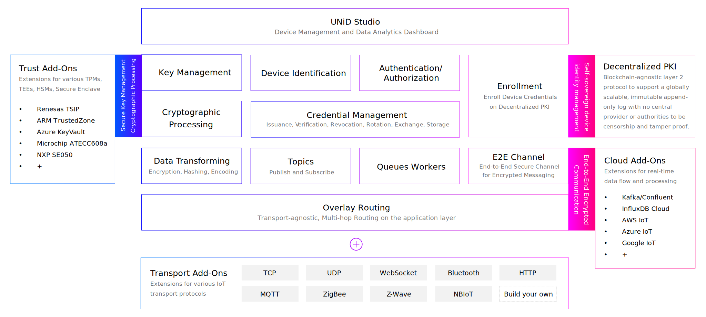

  

<h1 align="center" style="text-align: center;">UNiD</h1>

To automate device provisioning with secure edge computing.

## Features

- End-to-end secure channel
- E2E encrypted communication
- Decentralized public key infrastructure
- Hardware security module add-ons for key management
- Cloud add-ons for data processing

## Introduction

_UNiD EDGE_ is an open source Rust libraries that are lightweight and easy-to-integrate into a wide range of devices.

## Overview

By abstracting every device and cloud as globally unique endpoints and building an E2E secure channel, each endpoint can send encrypted messages regardless of the network topology or routing hops.

## Changelog

[CHANGELOG](CHANGELOG.md)

## License

[Apache License 2.0](LICENSE)
