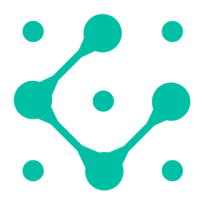
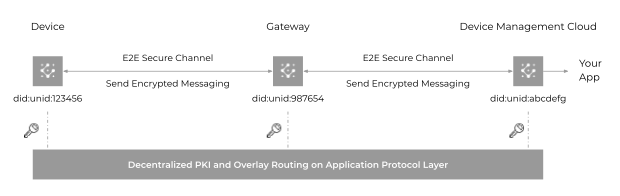
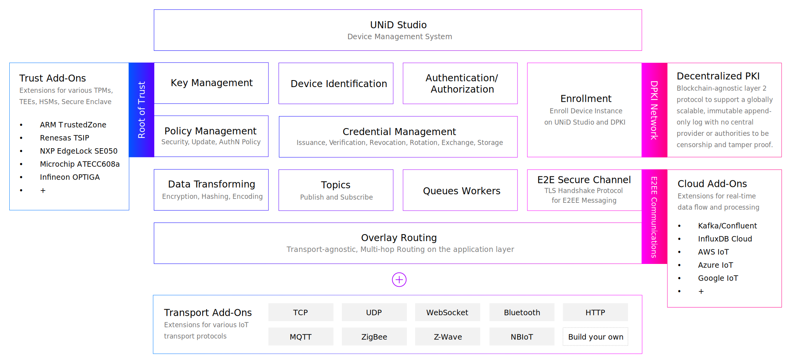

  

<h1 align="center">
  UNiD
</h1>

  
  
  
  
   
  Automate device security provisioning with edge intelligence

## Features

- Abstract the dev complexity of edge security
- Fully automated device provisioning
- End-to-end authenticated and encrypted communications
- Security lifecycle
- Overlay routing
- Cloud add-ons for real-time data flow and processing
- Developer-first

## Introduction

Hardware Root of Trust is the security foundation for an SoC, other semiconductor device or electronic system. The RoT contains the keys for cryptographic functions and is usually a part of the secure boot process providing the foundation for the software chain of trust. _UNiD_ is a set of libraries written by Rust that can leverage the RoT and decentralized identity technology to autonomously generate key pairs, register the credentials on a decentralized PKI, and build end-to-end secure channel by the TLS handshake protocol. This capabilities reduce the development cost of device security, increase flexibilities, and facilitates real-time data flow and processing.

  

## Overview

By abstracting every device and cloud as globally unique endpoints and building an E2E secure channel, each endpoint can send encrypted messages regardless of the network topology or routing hops.

  

## Quick Start

[TBD]

## Developer's Document

[TBD]

## Changelog

[CHANGELOG](CHANGELOG.md)

## License

[Apache License 2.0](LICENSE)
