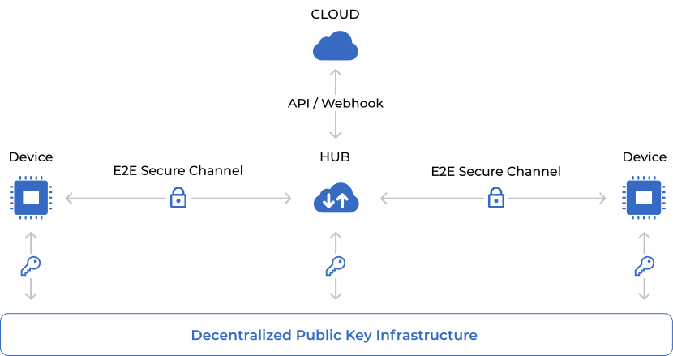

  

<h1 align="center">
  UNiD
</h1>

  
  
  
  
   
  E2E data security with edge intelligence

## Features

- Abstract security stack complexity with edge intelligence
- Fully automated provisioning
- E2E secure channel
- Security lifecycle
- Overlay routing
- Root of Trust add-ons
- Cloud add-ons for real-time data flow and processing
- Developer-first

## Introduction

UNiD is a simplified security stack to restore trust in all digital interaction, and make it universally verifiable and useful. The system software provides end-to-end data security between every device and the cloud. The system software uses decentralized identity (DID) as device identifier based on the W3C DID Core 1.0 specification. In RoT secure storage, the system software autonomously generates multiple key pairs from TRNG (PUF), and generates the payload by hashing the object containing these public keys information. This payload can be registered with DPKI (Decentralized Public Key Infrastructure) to generate a DID document, which can be treated as a globally unique identifier independent of any third party. This DID is a URI that associates the device with a DID document that allows trustable interactions.

The system software perform handshakes with a message broker to establish end-to-end secure connections with ECDH. In the handshake process, the system sends the public key (for encryption) and encrypted and signed message to the server as a client hello. The server generates a common key with the received public key, and decrypts message to verify the device's signature, and responses with encrypted and signed message to the device. The device then verifies the server’s signature and compares the server’s DID with the pre-configured DID to authenticate the server, and completes handshake process. All data exchanged with remote devices and servers is encrypted and signed. Data is encrypted with AES-GCM with a common key generated during the handshake. Integrity of the data is validated by verifying the signature in the RoT secure storage of the device. By abstracting every device and the cloud as globally unique endpoints, each endpoint can send encrypted messages regardless of the network topology or routing hops.

  

  

The system software will be available for devices with RoT functions. It allows developers to focus on application development without scratch building the complex security stack.

## Quick Start

[TBD]

## Developer's Document

- UNiD Official Website 
  https://www.getunid.io/
  
- UNiD Developers Portal 
  https://docs.getunid.io/

## Changelog

[CHANGELOG](CHANGELOG.md)

## Security

[SECURITY](SECURITY.md)

## License

[Apache License 2.0](LICENSE)
